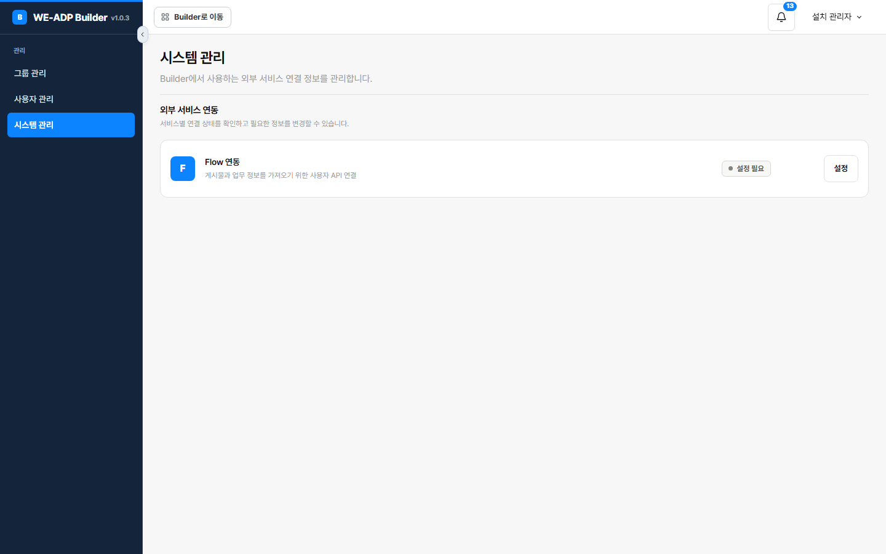

# Flow integration

> Reference documentation — `docs/adp/`. Describes the system as built, not as planned.
> The code is the source of truth; this file points at it. Verified against the tree on 2026-09-17.
> Flow is an external collaboration tool. Builder reads posts out of it; it never writes back.

## 1. What this is

Builder can pull a work request straight out of Flow instead of making someone retype it. One API key
serves the whole installation, and two features consume it.

| | |
|---|---|
| Direction | **Read only.** Builder fetches posts; nothing is ever sent to Flow |
| Credential | One key for the entire Builder installation — **not per project, not per person** |
| Where the key lives | Sealed in the database, registered through a screen. ⛔ Never in a configuration file |
| Consumers | [SRT fast track](09-srt.html) registration, and `DocumentType.FLOW` on received documents — see [Intake & doc reading](24-document-intake.html) |
| If unconfigured | Only the Flow paths close. Everything else works, and the server starts normally |

⚠ **The two halves live in different packages.** `com.bizplay.builder.flow` owns the *key* (four
files: the admin screen, the record, the mapper, the service). `com.bizplay.builder.intake` owns the
*fetch* (`FlowPostGateway`, `HttpFlowPostGateway`, `FlowPost`, `FlowPostException`). The split is why
this page exists: neither package tells the whole story.

## 2. The System Management screen

The third admin menu, after Group Management and User Management.

| | |
|---|---|
| Menu | Admin → **System Management** |
| Route prefix | `/admin/system` |
| Authorization | `@PreAuthorize("hasRole('SUPER')")` on the whole controller |
| Template | `admin/system.html` |

| Action | Method + route |
|---|---|
| View status | `GET /admin/system` |
| Save or replace the key | `POST /admin/system/flow` |



**The screen never shows the key back.** `FlowApiKeyService.status()` returns only
`(configured, updatedAt, updatedBy)` — a boolean and an audit trail, never the secret. The controller
resolves `updatedBy` to a person's name through `AccountMapper`, falling back to `확인할 수 없음` when
that account no longer resolves.

**Replacing means retyping the whole key.** There is no partial edit, because there is nothing to edit
against — the stored value is ciphertext.

**Success redirects, failure does not.** A saved key sets a flash message and redirects
(`redirect:/admin/system`); a rejected one re-renders `admin/system` directly with the error, so the
operator's typed input survives. Same pattern as the Group Management dialogs — see
[Project setup](04-project-setup.html).

### What a key must look like

`FlowApiKeyService.save` rejects three things, each with its own message:

| Rule | Message |
|---|---|
| Not blank after trimming | `Flow API 키를 입력해 주세요.` |
| At most 500 characters | `Flow API 키는 500자 이하로 입력해 주세요.` |
| Every character printable ASCII (`0x21`–`0x7E`) | `Flow API 키에 공백이나 한글이 섞여 있습니다. 발급받은 키를 그대로 붙여 주세요.` |

⭐ **The third rule is the useful one.** It catches a key pasted with a stray space, a line break, or
surrounding Korean text — the realistic paste accidents. Without it those reach the API and come back
as an opaque rejection at fetch time, far from the screen where the mistake was made.

The value is then sealed with `SecretSealer` and upserted. See
[Accounts & security](03-accounts-security.html) for the sealing scheme.

## 3. The gateway

`FlowPostGateway` is the boundary; `HttpFlowPostGateway` is the only implementation. It uses the JDK's
built-in `HttpClient` — there is no HTTP client dependency in this repository, and one call site does
not justify adding one.

| | |
|---|---|
| Base URL | `builder.flow.base-url`, default `https://api.flow.team`; trailing slashes stripped |
| Timeout | `builder.flow.timeout`, default `20s` |
| Auth | header `x-flow-api-key: <key>` |
| Method | `GET`, `Content-Type: application/json` |

**The key is fetched per request, not injected once.** The constructor takes a `Supplier<String>`
bound to `FlowApiKeyService::apiKey`, so a key replaced in the admin screen takes effect on the next
call without a restart.

**Every response must pass an envelope check**: `response.success` must be true *and* `response.data`
must be an object. A 2xx carrying a failure envelope is treated as a failure.

⛔ **Failures never echo the provider's response.** A non-2xx logs the status code alone; a parse
failure logs only the exception's class name. Both then raise the same `FlowPostException`:

```text
Flow 원문을 가져오지 못했습니다 — 업무번호 또는 게시물 ID와 접근 권한을 확인해 주세요.
```

A missing key is distinguished, because the fix is different and belongs to someone else:

```text
Flow API 연결 설정이 없습니다 — 관리자에게 문의해 주세요.
```

## 4. Finding a post by business number

This is the part that is not obvious. **A business number is not a post ID**, and Flow offers no
endpoint that maps one to the other. So `getByTaskNumber` searches:

```text
GET /user/projects?cursor=N          ─┐  page through every project the key can see
                                      │  (cursor loop, guarded)
   for each project:                   │
GET /user/posts/projects/{id}/tasks/filter?searchWord={number}
                                      │
   for each task: compare the task's own number  ← exact match only
                                      │
GET /user/posts/{postId}             ─┘  fetch the real post
```

Three details worth knowing:

- ⭐ **`searchWord` is treated as a hint, not an answer.** The gateway re-reads each returned task's
  own number out of `columns[].columnData[].customColumnData` and requires an **exact** match. A
  search that returns near-misses cannot import the wrong post.
- ⚠ **The cursor loop is guarded against repeating itself.** `visitedCursors` is a `Set<Long>`, and
  the loop condition is `visitedCursors.add(cursor)` — the moment the API returns a cursor already
  seen, the loop ends. Without it a provider paging bug becomes an infinite loop holding a request
  thread.
- ⚠ **The page shape is accepted two ways.** `projects` is read whether the array sits at the top of
  `data` or nested one level down, with `hasNext` / `lastCursor` read from whichever node carried it.

**Cost scales with the number of Flow projects the key can see** — one request per project until the
number is found. That is inherent to searching without a lookup endpoint.

### Input bounds differ by entry point

| Where | Rule |
|---|---|
| Registration form | `pattern="[0-9]{4,12}" maxlength="12"` — a browser hint only |
| `SrtService.registerFlow` | `^[0-9]+$`, at most 30 characters |
| `HttpFlowPostGateway.getByTaskNumber` | `^[0-9]{4,12}$` |
| `HttpFlowPostGateway.get` (post ID) | `^[0-9]{1,15}$` |

⚠ **The gateway is the binding constraint.** A 20-digit number passes the SRT service's check and is
then refused by the gateway with `Flow 업무번호는 4~12자리 숫자로 입력해 주세요.` If you are changing
these bounds, change them where they actually bite.

⚠ **The field takes a number, not a URL.** Pasting a Flow link fails.

## 5. Reading the body

A Flow post's text arrives in one of two shapes, and the gateway prefers the simple one.

1. If `outContent` is present, that is the text.
2. Otherwise `content` is parsed as Flow's editor JSON, and **only components whose `COMP_TYPE` is
   `TEXT` contribute**, via `COMP_DETAIL.CONTENTS`. Anything else is skipped.
3. If the parse fails, the raw `content` string is used rather than losing the post.

⛔ **A post with no title or no body is rejected outright** — `Flow 게시물에 제목이나 본문이
없습니다 — Flow에서 게시물을 확인해 주세요.` An empty import would otherwise become an SRT with
nothing in it, and the AI analysis downstream would have nothing to judge.

`FlowPost` carries `postId`, `title`, `content`, `connectUrl`, `projectTitle`, `attachments`
(`fileName`, `size`, `url`, `thumbnailUrl`) and `remarks` (comments, excluding deleted ones).

⚠ **Remarks are fetched but deliberately dropped when an SRT saves the original.** See
[SRT fast track](09-srt.html) — the stored `source_json` keeps the post, not the conversation.

## 6. Data model

`adk_builder_flow_api_key`

| Column | Type | Notes |
|---|---|---|
| `singleton_id` | `smallint` PK, default `1` | `CHECK (singleton_id = 1)` |
| `api_key_cipher` / `api_key_nonce` | `bytea` | Meaningless apart from each other |
| `updated_at` | `timestamptz` | default `now()` |
| `updated_by` | `varchar(7)` | FK to `adk_builder_account` |

⭐ **The single row is enforced by the database, not by convention.** The primary key defaults to `1`
and a `CHECK` forbids any other value, so a second key physically cannot be inserted — the mapper's
`upsert` is the only sensible write. This is an installation-wide credential, and the schema says so.

## 7. Configuration

| Key | Default | Note |
|---|---|---|
| `builder.flow.base-url` | `https://api.flow.team` | Trailing slashes stripped in the record's compact constructor |
| `builder.flow.timeout` | `20s` | |

⛔ **There is no `builder.flow.api-key`, and there must not be.** The key is registered through the
screen and sealed into the database. Operational context: [Install & operations](21-operations.html).

⚠ **A changed `builder.secret-key-base64` makes the stored key unreadable.** Back up the sealing key
with the database, or the Flow key must be registered again.

## 8. Code map

| File | Role |
|---|---|
| `flow/AdminSystemController.java` | `/admin/system`, SUPER only; status and save |
| `flow/FlowApiKeyService.java` | Validation, sealing, `status()`, `apiKey()` |
| `flow/FlowApiKey.java` | The sealed record plus its audit fields |
| `flow/FlowApiKeyMapper.java` | `selectOne` / `upsert` — one row by design |
| `config/FlowProperties.java` | Base URL and timeout, with defaults |
| `intake/FlowPostGateway.java` | The boundary: `get(postId)`, `getByTaskNumber(number)` |
| `intake/HttpFlowPostGateway.java` | JDK `HttpClient`, project scan, envelope check, body parsing |
| `intake/FlowPost.java` | Post, `Attachment`, `Remark` |
| `intake/FlowPostException.java` | Carries the operator-facing next action |
| `templates/admin/system.html` | The screen |

## 9. Guarantees covered by tests

Test method names in this project are Korean sentences stating what is guaranteed, by convention.

**`HttpFlowPostGatewayTest`** — searching projects by business number retrieves an original that has
attachments and comments · in editor JSON, only `CONTENTS` is read as the document body · a post's
detail is queried with the API key and its title and body are read.

```bash
./mvnw test -Dtest='HttpFlowPostGatewayTest,Srt*Test'
```

## 10. Traps

1. **Do not put the Flow key in a configuration file.** It is registered on screen and sealed into the
   database; a file copy would outlive the rotation.
2. **Do not render the key back to the screen.** `status()` exposes only whether one exists and who
   set it.
3. **Do not accept a key with whitespace or non-ASCII.** The paste accident is real, and the failure
   otherwise surfaces far from its cause.
4. **Do not bind the key once at construction.** The supplier is what lets a replacement take effect
   without a restart.
5. **Do not trust `searchWord` results.** Compare each task's own number exactly, or a near-miss
   imports the wrong post.
6. **Do not page without a visited-cursor guard.** A repeating cursor becomes an infinite loop.
7. **Do not echo the provider's response into an error.** Status code and exception class only.
8. **Do not treat 2xx as success.** The envelope's `success` flag and `data` object decide.
9. **Do not import a post with no title or body.** An empty SRT gives the analysis nothing to judge.
10. **Do not widen the business-number bounds in one place only.** Four different checks apply; the
    gateway's `4–12` is the one that actually refuses.
11. **Do not add an HTTP client dependency for this.** One call site; the JDK's is enough.
